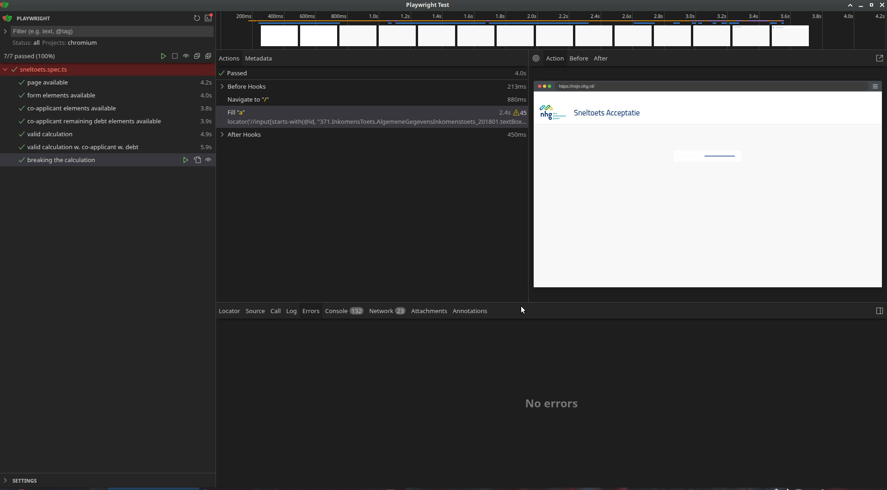

# Toolkit

- [Node.js](https://nodejs.org/en)
- [PlayWright](https://playwright.dev/docs/intro)
- [IntelliJ IDEA](https://www.jetbrains.com/idea/) Community edition.

# Werkwijze

- Keuzes, keuzes, keuzes: `Javascript`, `Typescript`, `Java` of misschien zelfs `Python`? Hangt van de aanwezige kennis af. Mijn inziens biedt Java (of Python) de meest toegankelijke code. Eventueel gecombineerd met [Cucumber](https://cucumber.io/). Voor de snelheid kies ik voor de opdracht voor `TypeScript`. Voor de langere termijn zou ik hier niet voor kiezen.
- Ben wel begonnen met het opzetten voor een `Playwright for Java` project, maar merkte dat dit meer aandacht behoefte. Het optuigen van een goed & net project, vereist voor nu te veel tijd. 
- Basis validatie implementeren, afzonderlijke elementen identificeren m.b.v. de web developer tooling in de browser (in mijn geval Chromium).
- Elementen hebben mooie id's... met een willekeurig element in de naam :) en `XPATH` en `regular expressions` lijken nog geen goede vrienden. 
- Bij het werken naar een eerste POC worden er TODO's verzameld. De eerste implementatie gaat recht op het doel af. Wil daarmee (te veel) `premature optimization` voorkomen.
- Nu de meeste elementen een locator hebben, worden de test cases verder uitgewerkt.
- Oh dear, assignment schrijft voor een toets met 'medeaanvrager'.
- Gegeven de gestelde tijd en de tijd die aan de opdracht is besteed, komt het vermoeden dat het gebruik van XPATH locators niet in de lijn van verwachtingen ligt? Ik ben/blijf vooralsnog voorstander van deze aanpak.
- Fix brainfart: vervang `//*` met `//input` (of ander type) en verwijder check op `not(contains(@id, 'label'))`.
- Uitbreiden happy trail test met co-applicant opties.

# Uitvoeren tests

Tests `headless` uitvoeren:
```shell
npx playwright test
```

Test uitvoeren binnen UI:
```shell
npx playwright test --ui
```

Test rapport inzien:
```shell
npx playwright test
```

# Test Resultaat
